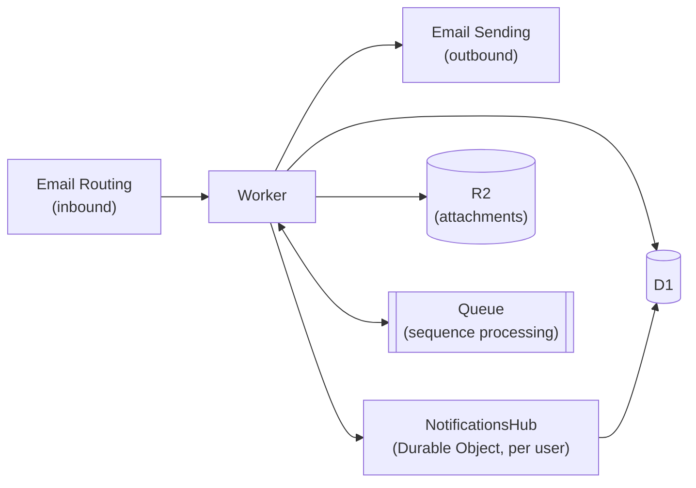

[saasmail](../README.md) › [Docs](README.md) › **Architecture**

# Architecture

<picture>
  <source media="(prefers-color-scheme: dark)" srcset="diagrams/saasmail-architecture-dark.png">
  
</picture>

Everything runs inside a single Cloudflare Worker — no separate mail server to
operate.

## Stack

| Layer               | Technology                                                                |
| ------------------- | ------------------------------------------------------------------------- |
| **Receive email**   | Cloudflare Email Workers                                                  |
| **Send email**      | Cloudflare Email Sending, Resend, Bavimail, or Postmark                   |
| **Runtime**         | Cloudflare Workers + Hono                                                 |
| **API**             | Zod + `@hono/zod-openapi` (OpenAPI 3.0)                                   |
| **Database**        | Cloudflare D1 (SQLite)                                                    |
| **File storage**    | Cloudflare R2 (attachments)                                               |
| **Queue**           | Cloudflare Queues (sequence processing)                                   |
| **Realtime + Push** | Durable Object (`NotificationsHub`, one per user) — WebSockets + Web Push |
| **Web Push**        | VAPID + `aes128gcm` payload encryption (RFC 8291), implemented in-worker  |
| **Service Worker**  | `public/sw.js` — receives push events, renders OS notifications           |
| **Cron**            | Hourly trigger for sequence email scheduling                              |
| **Frontend**        | React + Tailwind CSS + TipTap editor                                      |
| **ORM**             | Drizzle                                                                   |
| **Auth**            | BetterAuth with passkey support                                           |

## Message model

User-visible mail has one application-level read model even though received and
sent messages stay in separate D1 tables:

```text
emails (received) ──┐
                    ├── queryMessages() ── customer timeline / search / conversations
sent_emails (sent) ─┘
```

A delivered or received message is the communication primitive. The unified
stream is exactly `emails ∪ sent_emails`. Operational rows such as
`outbox_emails`, `campaign_recipients`, `sequence_emails`, and
`campaign_events` are delivery/workflow state and never become messages on
their own. Campaign and sequence sends enter history through the
`sent_emails` rows they already produce.

`worker/src/lib/messages/` owns the `UnifiedMessage` contract, source
adapters, deterministic ordering, permission-scoped filtering, attachment
enrichment, and cursor pagination. Existing page/offset HTTP routes remain
compatibility wrappers over that service. New consumers should use
`queryMessages()` rather than unioning `emails` and `sent_emails`
themselves.

The legacy `emails.is_read` field remains shared team state in this stage.
Mailbox/user state, canonical 1-on-1 conversation identity, and JMAP semantics
are deliberately separate later changes.

## Realtime, push, and queues

The diagram above stops at the storage layer. This one adds the per-user Durable
Object that fans notifications out to live tabs and devices:



The `NotificationsHub` Durable Object is keyed per user (`idFromName(userId)`). On inbound mail the worker fans out to each recipient's hub, which pushes WebSocket frames to live tabs and sends encrypted Web Push to registered devices. The queue carries scheduled sequence emails — the cron trigger enqueues due steps and a queue consumer in the same worker sends them.

---

**See also:** [Email providers](email-providers.md) · [Local development](development.md) · [AGENTS.md](../AGENTS.md) for the code-layer conventions
