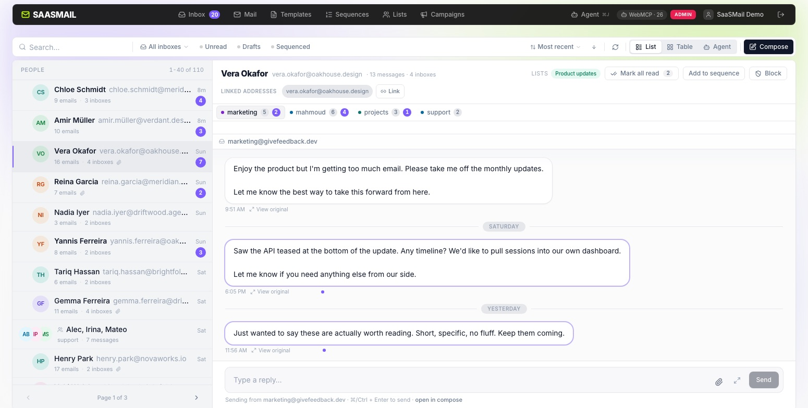

[saasmail](../README.md) › [Docs](README.md) › **Inboxes and timelines**

# Inboxes and timelines



## One timeline per customer

Every email from a given person — marketing campaigns, transactional notifications, support replies — lands on a single timeline. People are sorted by recency with unread counts, so the customer who needs attention is always on top. Click in to see the latest message, and open the thread sidebar to replay the full history. Messages render as sanitized HTML with a Slack-style reply composer.

## Multi-inbox with team permissions

Run multiple inbound addresses from a single deployment. Admins configure display names per inbox (`support@`, `sales@`, etc.) and assign members to specific inboxes. Members only see email, templates, and sequences scoped to the inboxes they're allowed to access.

## Thread or chat, per inbox

Different inboxes call for different UX. Set each inbox to render as **Thread** or **Chat**:

- **Thread** — traditional email threading with subject lines, quoted history, and formatted HTML. The right fit for `marketing@` and `newsletters@`, where context lives inside the message.
- **Chat** — bubble-style conversation view that strips away subjects and signatures so replies feel like iMessage. The right fit for `support@`, where customers expect a back-and-forth, not a formal thread.

One deployment, one person timeline, but the interaction model matches the channel.

## Replying

A reply goes where the sender asked for it. When a received message has a
`Reply-To` header (a ticketing system, a contact form, a `noreply@` notification
that names a real support address), the reply is addressed to that address
instead of the `From` address. If the header lists several addresses, the first
becomes To and the others are added to Cc.

The reply composer and the chat view's quick reply say so before you send
("Replies go to support@acme.com (the sender asked for replies there)"), name
every address that will get a copy, and offer **Reply to the sender instead**,
which ignores the header altogether. The mail view's reading pane shows the
`Reply-To:` line on such a message. An address is never both in To and in Cc.

Two guards apply:

- A Reply-To address that is one of this instance's own inboxes is ignored, so a
  message whose Reply-To points back at you never makes saasmail mail itself.
  With no other address left, the reply goes to the sender.
- [Rule auto-replies](automations.md#auto-replies) always answer the sender,
  whatever the header says.

The reply stays on the original sender's timeline, marked with the address it
went to; it does not start a timeline for the Reply-To address. A reply written
in a group conversation stays in that conversation.

The API and MCP behave the same way. `POST /api/send/reply/{emailId}` and the
MCP tool `reply_email` follow Reply-To by default; pass `recipient: "sender"` to
answer the `From` address. Both return `to`, the address the reply went to,
`cc`, every address it was copied to, and `repliedTo` (`reply_to` or `sender`).
To see the addresses beforehand, read `replyRecipients` on the message
(`GET /api/emails/{id}`, MCP `read_email`). The web composers always send
`recipient`, so a reply never goes to an address they did not show.

## Unknown recipients

An Email Routing catch-all rule sends mail for any address under your domain to
saasmail, and by default all of it is stored, including mail to addresses no
inbox has. Turn on **Reject mail to addresses that aren't inboxes** at the
bottom of the **Inboxes** page (or `PATCH /api/admin/settings` with
`{"rejectUnknownRecipients": true}`) and such mail is refused while the sending
server is connected, with `No such mailbox`. Nothing is stored, and the audit
log records `inbound.rejected` with the address. The check runs first, before
the blocklist and the [rules](automations.md#rejecting-mail).

An address counts as an inbox when it has a sender identity (it was created or
edited on the Inboxes page) or members assigned to it, whatever its case. The
Inboxes page also lists addresses that only ever received mail through the
catch-all; those are not inboxes, and turning the setting on first lists the
ones that received mail in the last 30 days and asks you to confirm. To keep
one, give it a sender identity or assign members. Also:

- Plus addresses are separate addresses: `support+orders@` is refused unless
  it is an inbox itself.
- A **Forward to** address on your own domain that is not an inbox is refused
  too, so forwarded copies to it bounce.
- Refusing unknown addresses tells a sender which addresses exist, as any mail
  server that rejects them does.
- Each refusal writes one audit row (kept 180 days by default), so a
  dictionary attack shows up there in volume.

## Learning spam filter

Each inbox can have a spam filter that learns from your team: **Learn from junk
marks** under Spam threshold on the **Inboxes** page (off by default). It is a
naive-Bayes filter in the style of SpamAssassin's and Thunderbird's, one per
inbox, kept in D1.

- **What trains it**: a person marking a message as junk (spam) or taking it
  out of Junk (not spam), from the web app, the API, MCP or JMAP, and a person
  replying to a received message nobody has labelled yet (not spam; through
  the web app, the API or MCP's `reply_email`). Rules, the spam threshold, the
  agent, auto-replies and imports never train it, so it cannot learn from its
  own output or from a model a message talked into something. A message counts
  once, even if two people mark it at the same moment; changing its label
  moves it, and a reply never undoes an explicit junk mark. One web or API mark
  trains at most 50 messages; a JMAP client moves messages one by one, so each
  one it moves trains. An API key or MCP client that replies to everything
  automatically would teach the filter that everything is fine: give such
  integrations their own inbox.
- **When it scores**: once it has seen 20 junk and 20 not-junk messages, each
  new message gets a spam probability from 0 to 1 (Graham's method with
  Robinson's smoothing: a word seen once or twice weighs little) (shown in the reading pane
  as "Spam probability 0.97 (learned filter)" and on the message as
  `spamProbability`). A message with too little evidence gets none.
- **Acting on it is a rule**: the condition `spam_probability ≥ 0.9` with Mark
  as spam. **Create the junk rule** opens Automations with that rule
  prefilled for the inbox. The filter itself never files anything.
- **Reset** forgets everything it learned (it stays on or off). Each inbox keeps
  about 100,000 tokens: the hourly pass removes the rarest, oldest ones beyond
  that, at most 10,000 at a time.

The API: `GET /api/admin/inboxes` returns `spamFilter: { enabled,
spamMessages, hamMessages, ready }`, `PUT /api/admin/inboxes/{email}/spam-filter`
with `{ enabled }` turns it on or off, and
`POST /api/admin/inboxes/{email}/spam-filter/reset` empties it; both are
recorded as `inbox.updated`.

## Per-inbox forwarding

Give any inbox a **Forward to** address and every message it receives is re-sent to
that address. Configured per inbox on the **Inboxes** page, right next to display
name, signature, mode, and member permissions. Off by default.

**Why not just use a Cloudflare Email Routing forwarding rule?** Because Email
Routing relays forwarded mail from a shared IP pool that Outlook, Hotmail, and Live
blocklist. Forwards to a Microsoft-hosted mailbox come back as:

```
permanent error (550): 5.7.1 Unfortunately, messages from [104.30.10.66] weren't
sent. Please contact your Internet service provider since part of their network is
on our block list (S3150).
```

That IP belongs to Cloudflare, not to you, so there is no delisting path. saasmail
sidesteps it by sending the copy itself through your [configured outbound
provider](email-providers.md) — different IPs, and DKIM-signed for your own domain,
so it authenticates cleanly.

How the forwarded copy looks:

- **From** the inbox address, with the original sender named in the display name
  (`"Jane Customer (via Acme Support)" <support@acme.com>`). It cannot keep the
  original `From:` — sending as `jane@example.com` from your infrastructure would
  fail SPF and DMARC and get filtered harder than the block being avoided.
- **Reply-To** the original sender, so replying reaches the customer.
- Original `From` / `Date` / `Subject` / `Cc` and the SPF/DKIM/DMARC verdicts are
  restated in a header block at the top of the body.
- Attachments are included, up to your provider's size ceiling; anything too large
  is named in the body rather than silently dropped. Inline images arrive as regular
  attachments.
- The original `Cc` recipients are **not** re-sent to — only the destination is.

Forwarding is best-effort and never blocks inbound mail: it runs after the message
is safely stored, and after the blocklist and duplicate checks, so blocked senders
and duplicate deliveries are never forwarded. There is no retry — failures are
logged. Loops are prevented three ways: an inbox can't forward to itself, can't
forward to another inbox on the same instance, and any message already carrying the
`X-SaaSMail-Forwarded-For` header is never forwarded again.

---

**See also:** [Users and API keys](users-and-api-keys.md) for the permission model · [Webhooks](webhooks.md) to fire on inbound mail · [Email providers](email-providers.md)
