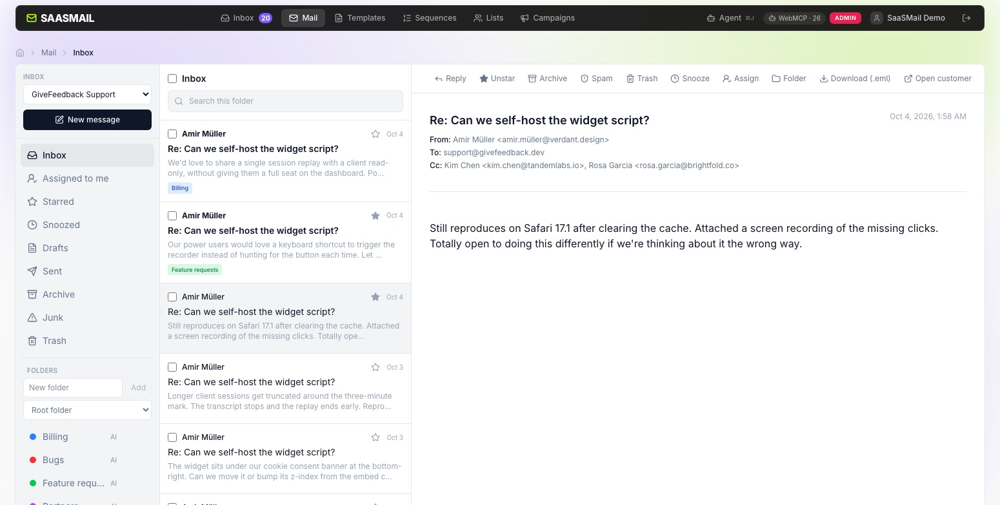

[saasmail](../README.md) › [Docs](README.md) › **Mailbox state**

# Mailbox state

Message state is stored separately from the canonical received and sent message
rows. Reads still come from the unified `queryMessages()` service; state only
changes visibility when a caller explicitly asks for a folder/filter policy.

## State model

Personal state is keyed by user and message:

- **seen** — received mail bootstraps from `emails.is_read` until that viewer has
  a `message_user_state` row. Once a row exists, `seen_at` is authoritative.
- **starred** — personal to the viewer; another user cannot see the star.
- Sent messages are always seen.

Shared inbox state is keyed by message:

- **archived**
- **spam**
- **trashed**

Conversation snooze state is shared per inbox and conversation key, which
depends on the inbox's
[conversation mode](inboxes.md#conversations-by-customer-or-by-thread). Grouped
by customer (the default), a group thread uses its `conversation_id` and a
one-to-one thread uses `p:<person_id>`. Grouped by thread, every message also
carries a `thread_key` (`t:` and the SHA-256 of its thread's root Message-ID),
which comes first: the key is `COALESCE(thread_key, conversation_id, 'p:' ||
person_id)`, so reads never look the mode up. Messages without any of these
have no conversation and cannot be snoozed.
`snoozed_until` is evaluated at read time, so no scheduler or cron job is
needed. A new received message clears the snooze for that conversation; outbound
replies do not.

Archive and spam apply only to received mail. Trash applies to both received and
sent mail. Custom folders are rows in `mailboxes` plus
`message_mailboxes` memberships; system folders are derived and are never
mailbox rows.

## Folder definitions

| Folder         | Messages included                                                                           |
| -------------- | ------------------------------------------------------------------------------------------- |
| Inbox          | Received only; not archived, spam, trashed, or actively snoozed                             |
| Sent           | Sent only; not trashed. Campaign sends are excluded by default on the HTTP/MCP Sent surface |
| Archive        | Received only; archived, not spam or trashed                                                |
| Junk           | Received only; spam, not trashed                                                            |
| Trash          | Received and sent with trash state                                                          |
| Snoozed        | Received only; actively snoozed, not spam or trashed                                        |
| Drafts         | Current user's rows from `drafts`, optionally filtered to the selected inbox                |
| Custom mailbox | Members of that mailbox, not trashed, scoped to the mailbox inbox                           |

A message that is both spam and trashed appears in Trash. Removing the trash
state makes it visible in Junk again.

`queryMessages()` is visibility-neutral when no folder/include flags are
supplied: archived, spam, trashed, and snoozed messages are not hidden
implicitly. Callers can set `includeSnoozed: false` for a neutral non-folder
query that should exclude active snoozes. Each
surface opts into its own policy. The existing per-person timeline excludes
spam and trash but continues to show archived messages.

## HTTP API

All routes use the normal authenticated API middleware and inbox permissions.

### Read messages

`GET /api/messages`

Query parameters:

- `inbox`
- `folder=inbox|sent|archive|junk|trash|snoozed`
- `mailboxId` for a custom mailbox
- `starred=true`
- `unseen=true`
- `includeTrashed=true|false`
- `includeSpam=true|false`
- `personId`
- `q`
- `cursor`
- `limit` (default 50, maximum 100)
- `excludeCampaignSends=true|false`

The response is `{ messages, nextCursor }`. Message references are serialized
as `received:<id>` or `sent:<id>`. Each message includes a `state` object
with `seen`, `starredAt`, `archivedAt`, `spamAt`, `trashedAt`,
`mailboxIds`, `conversationKey`, and the active `snoozedUntil` value (or
`null` after expiry).

When `folder=sent`, campaign sends are excluded unless
`excludeCampaignSends=false` is supplied.

`GET /api/messages/{received|sent}/{id}/raw.eml` downloads one message as an
RFC 5322 `.eml` file: its original bytes when they were kept, otherwise a
rebuild marked `X-Saasmail-Reconstructed: yes`. The reading pane's
**Download (.eml)** uses it. See [Export, import and backups](data.md), which
also exports a whole inbox as mbox.

### Mutate state

- `POST /api/messages/user-state` — `{ refs, seen?, starred? }`
- `POST /api/messages/mailbox-state` — `{ refs, archived?, spam?, trashed? }`
- `POST /api/messages/mailbox-membership` — `{ refs, add?, remove? }`
- `POST /api/messages/snooze` — `{ refs, until }`, where `until` is a
  future Unix timestamp no more than 366 days away, or `null` to clear snooze

Each request accepts at most 500 message refs.

### Manage custom mailboxes

- `GET /api/mailboxes?inbox=...`
- `POST /api/mailboxes` — `{ inbox, name, parentId?, color?, aiDescription? }`
- `PATCH /api/mailboxes/{id}` — `{ name?, sortOrder?, color?, aiDescription? }`
- `DELETE /api/mailboxes/{id}`

A custom folder may have a `color` (one of `red`, `orange`, `amber`,
`yellow`, `lime`, `green`, `teal`, `cyan`, `blue`, `violet`, `purple`, `pink`)
and an `aiDescription`: up to 300 characters saying what belongs in it, which
lets [AI filing](automations.md#ai-filing) file mail into it. An empty
description removes it. An inbox can have at most 30 described folders
(`400 TOO_MANY_AI_FOLDERS`). Neither field exists in JMAP.

`POST /api/messages/ai-file` with `{ refs }` (at most 50 received messages
the caller can see) asks the AI to file them into their inbox's described
folders, in the background, and answers `202 { queued, skipped }` (mail in
Junk or Trash is skipped). At most 20 requests an hour per person
(`429 AI_FILE_RATE_LIMITED`). It needs a
[configured model](agent.md#provider-selection) (`400 NO_MODEL`) and a
described folder in each inbox (`400 NO_AI_FOLDERS`), and records one
`mail.ai_file_requested` audit row.

Inaccessible messages/mailboxes are reported as `404`; invalid state/query
requests as `400`; duplicate mailbox names as `409`.

## MCP and WebMCP

The remote MCP server exposes:

- `list_messages` — requires `email:read`; mirrors `GET /api/messages`.
- `set_message_state` — requires `email:manage`; supports
  seen/starred/archive/spam/trash plus `snoozeUntil`.

WebMCP exposes the same tool names for the signed-in browser session. Its
`set_message_state` supports seen, starred, archive, spam, and reversible
`snoozeUntil`, but it still cannot trash or delete messages.

## Contributor invariants

- Unified message reads go through `worker/src/lib/messages/query.ts`.
- Message state mutations go through `worker/src/lib/messages/state.ts`;
  conversation snooze mutations go through
  `worker/src/lib/messages/conversation-state.ts`.
- Every hard-delete of a message must call `deleteMessageState()` before the
  message row is removed.
- State lookups that can exceed D1's bound-parameter limit are batched.

## Conventional mailbox UI

The web app exposes a conventional three-pane mailbox at `/mail` alongside the
customer-centric inbox at `/`. The mailbox UI reads the same unified message
rows and state described above; it does not maintain a second copy of mail.

Routes are URL-addressable:

- `/mail/:inbox/:folder` for Inbox, Starred, Snoozed, Sent, Archive, Junk,
  and Trash.
- `/mail/:inbox/f/:mailboxId` for custom folders.
- `?m=received:<id>|sent:<id>` selects a message.
- `?q=...` searches the current folder.

Opening a received message marks personal `seen` state through
`POST /api/messages/user-state`. Star/archive/spam/trash, snooze, and custom
folder actions use the state APIs above.

A custom folder's pencil opens its settings: name, colour, and "What belongs
here?", the description AI filing uses. The rail shows the colour dot and an
**AI** marker on described folders; message rows show up to three chips for
the custom folders a message is in (name and colour), then "+N". **File with
AI**, in the reading pane's Folder menu and in the bulk selection bar, files
the selected received mail; it is disabled, with the reason, when the inbox
has no described folder or no model is configured. Filed folders appear a few
seconds later in every open tab. HTML bodies are rendered only after
the same `sanitizeEmailHtml()` sanitization used by the customer timeline.

The Starred surface is a neutral `starred=true` read with
`includeTrashed=false&includeSpam=false`; filtering happens in SQL before
cursor pagination, not in the browser. Sent hides campaign sends by default and
offers an explicit toggle to include them.

Live `email_received` events reload the first page when the user is already at
the top of the current inbox. When scrolled down, the UI shows a **New messages**
control instead of replacing the visible page. In-page/WebMCP state mutations
dispatch the mailbox refresh event and reload authoritative state.

Users can choose **Customers** or **Mailbox** as the default home view in
Settings. The preference is stored as `saasmail.defaultView`; only the exact
`/` route redirects to `/mail`, so deep links are never rewritten.

Mailbox rows support multi-selection and select-all over the currently loaded
cursor pages. Bulk state mutations are sent in chunks of at most 500 message
references per request; if any later chunk fails, the first page is refetched
instead of rolling back to a stale client snapshot. Archive and spam are only
offered when the entire selection is received mail. Bulk actions cover
seen/unseen, star/unstar, archive/unarchive, spam/not-spam, trash/restore,
snooze, and custom-folder moves.

Custom folders may be created at the root or under another custom folder,
renamed, or deleted with confirmation. Children are indented beneath their
parent in the folder rail.

The mailbox also has page-scoped keyboard shortcuts: `j`/`k` move the
keyboard cursor, `Enter` or `o` opens it, `u` returns to the list, `x`
toggles selection, `e` archives, `s` stars, `#` trashes, `r` replies,
and `?` opens the shortcuts dialog. Shortcuts are ignored while focus is in
an input, textarea, select, or contenteditable element, and for command/control
modifier combinations.

## Drafts

Drafts remain in the existing user-scoped `drafts` table; there is no second
mailbox draft store. `GET /api/drafts/list` returns only the authenticated
user's drafts newest-first with summary fields, supports `limit` (default 50,
maximum 100) plus `offset`, and accepts an optional `inbox` filter. Inbox
filters are trimmed and lowercased and include drafts whose `from_address` is
null so an unassigned draft is still reachable. With `includeMailClient=1` (the
web's Drafts folder) the first page also lists the user's drafts made in a JMAP
mail client, as `jmap:<id>` items: read-only, shown with
`GET /api/drafts/jmap-preview` and deletable with `DELETE /api/drafts`; those
aren't paged.

The Mailbox **Drafts** folder uses three context namespaces:

- `compose` — the legacy single compose draft.
- `reply:<emailId>` — reply drafts; opening one loads the received message and
  opens its ReplyComposer, which restores that context.
- `draft:<id>` — independent new-message drafts. **New message** creates a
  fresh context so multiple drafts can coexist.

`ComposeModal` accepts an optional `contextKey` and defaults to `compose`,
so all existing callers retain their prior behavior. Draft deletion uses the
existing `DELETE /api/drafts?contextKey=...` route.

## Learned spam probability

Received messages carry `spamProbability` (0–1, or null) when their inbox's
[learning spam filter](inboxes.md#learning-spam-filter) scored them on
arrival. It is a score only: a rule with the `spam_probability` condition
decides what to do with it. A person's junk and not-junk marks through the
state APIs above, and replies, train the filter.

## Per-inbox spam threshold

Each sender identity can optionally set a numeric spam threshold from 0 through 100. When a new inbound message carries an `X-Spam-Score` header and its
parsed score is greater than or equal to that inbox's threshold, the message is
filed into Junk through the system mailbox-state helper with `updated_by =
NULL`.

The score is SpamAssassin-style; **5.0 is a common threshold**, but the value is
operator-configurable. This rule only applies when incoming mail actually
carries `X-Spam-Score`; no score means no automatic filing. Leaving the inbox
threshold empty disables the behavior.

Auto-filed spam is silent: it does not wake a snoozed conversation and does not
fan out push or realtime notifications. Spam-state write failures are logged
and never break inbound delivery; if filing fails, the message follows the
normal non-spam wake/notification path.
