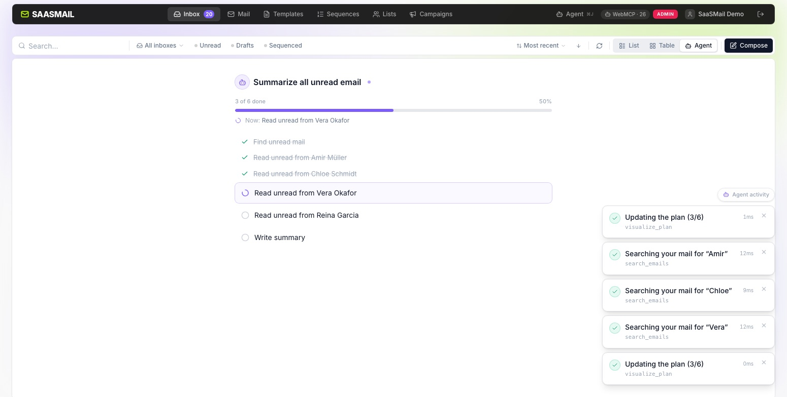

[saasmail](../README.md) › [Docs](README.md) › **WebMCP**

# WebMCP (in-page AI agent access)

Separate from the [`/mcp` server](mcp.md), saasmail also implements
[WebMCP](https://github.com/webmachinelearning/webmcp) — a W3C proposal that
lets a page register tools directly on `document.modelContext` /
`navigator.modelContext` for an AI agent already embedded in the browser to
discover and call. There is no server endpoint and no OAuth flow: the tools
run client-side, in the same tab as the logged-in user, using their existing
session cookie.

## How it differs from `/mcp`

|               | `/mcp` (remote)                      | WebMCP (in-page)                                                                                                   |
| ------------- | ------------------------------------ | ------------------------------------------------------------------------------------------------------------------ |
| Runs          | Server, any MCP client, any location | In the open browser tab                                                                                            |
| Auth          | OAuth 2.1, scoped token              | Existing browser session cookie                                                                                    |
| Access        | Whatever the token's scopes allow    | Whatever the logged-in user can do                                                                                 |
| Sends/deletes | Scope-gated, no extra confirmation   | Staged, then require human confirmation in the UI                                                                  |
| Effect        | Calls the HTTP API directly          | Reads via the same API client; actions drive the visible UI (navigation, the compose drawer, filtered inbox views) |

Both exist side by side — `/mcp` is for external agents connecting to your
inbox from anywhere; WebMCP is for an agent already inside the page, acting as
the signed-in user.

## Trying it

WebMCP is early and not yet in a browser by default. Two ways to test it today:

- **Chrome 149+** — enable `chrome://flags/#enable-webmcp-testing`, then sign
  in to saasmail and open a conversation with a page-aware agent.
- **ChatGPT's in-app browser** — open your saasmail instance inside it while
  signed in.

If neither the native `document.modelContext` API nor `navigator.modelContext`
is present, saasmail falls back to loading the
[`@mcp-b/global`](https://www.npmjs.com/package/@mcp-b/global) polyfill so the
same tools still register.

## Safety model

- **Session-scoped.** The agent can only do what the signed-in user's session
  already permits — there is no separate credential or elevated access.
- **Never sends or deletes.** WebMCP is read + draft + navigate only. It has
  no send or delete tool: `compose_email`, `compose_from_template`, and
  `reply_email` produce drafts the signed-in user reviews and sends by hand —
  the agent cannot dispatch or destroy mail on its own.
- **Newsletters are read-only.** An agent can report on lists and campaigns
  but cannot create, edit, schedule or send one. A campaign send is
  irreversible and reaches thousands of strangers at once, which is exactly
  the capability that should stay behind a human click.
- **Watchable.** A bottom-right activity popup surfaces each tool call as it
  runs (running → done/error), so the agent's work is visible rather than
  happening on an idle screen.
- **Per-instance toggle.** Set the `app_settings` row with key
  `webmcp_enabled` to the string `false` to stop the UI from registering any
  WebMCP tools; it is exposed to the frontend as `webmcpEnabled` on
  `GET /api/config` and defaults to `true` when unset.

## Tool list

**26 total: 17 read, 9 action.** Read tools return data through the same `/api`
client the UI already uses. Action tools drive the real UI — they navigate, open
the compose drawer pre-filled, save a reply draft into the inbox Drafts filter,
enroll a contact and switch to the Sequenced view, or render the agent's live
plan on the Agent Plan tab — rather than calling a write endpoint directly.
`get_playbook` is the entry point: it returns how to operate the inbox plus
step-by-step plans for common workflows (summarize unread, reply to unread,
enroll contacts by criteria).

Read: `get_playbook`, `whoami`, `list_inboxes`, `list_conversations`,
`list_contacts`, `get_contact`, `list_emails`, `list_messages`, `read_email`, `search_emails`,
`list_templates`, `get_template`, `list_sequences`,
`list_newsletter_lists`, `get_newsletter_list`, `list_campaigns`,
`get_campaign_stats`.

Action: `open_contact`, `compose_email`, `compose_from_template`,
`reply_email`, `mark_read`, `mark_unread`, `set_message_state`,
`enroll_in_sequence`, `visualize_plan`. `set_message_state` sets seen, starred,
archived, spam or snooze state; it cannot trash or delete.

Tools live in `src/webmcp/` — see [AGENTS.md](../AGENTS.md#webmcp-tools) for
how to add one.

---

**See also:** [MCP server](mcp.md) · [Users and API keys](users-and-api-keys.md)
